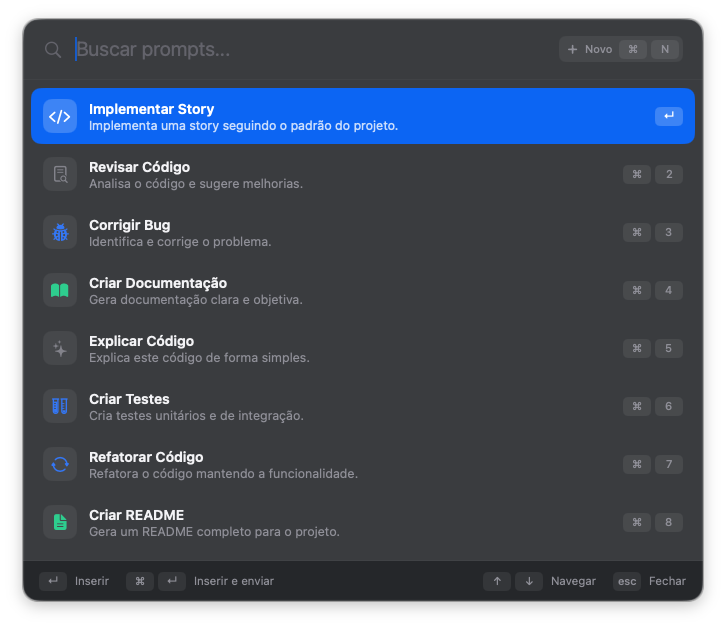
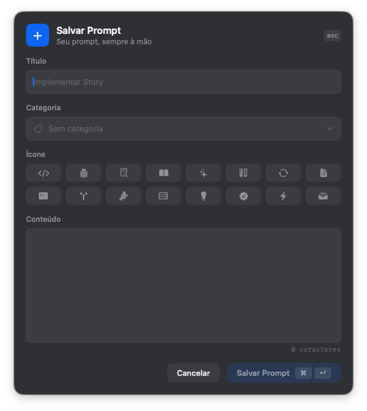

<p align="center">
  
</p>

<p align="center">
  <strong>Reusable prompts, one keystroke away from whatever you are typing in.</strong>
</p>

<p align="center">
  Promptbox is a native macOS launcher that stores the prompts you keep rewriting and
  inserts them straight into the app you were already working in — Claude Code, Codex,
  OpenCode, Ghostty, iTerm, Warp, Cursor or VS Code.
</p>

<p align="center">
  Built with <strong>Swift 6, SwiftUI and AppKit</strong>.
</p>

---

<p align="center">
  
</p>

## What is Promptbox?

Promptbox is a floating launcher for text you reuse.

It is not an IDE, an AI client, a workflow engine or a terminal. It does one loop:

```text
Save text  →  Find text  →  Insert text
```

Press `⌥Space` anywhere, type a few letters, press `↵`. The panel disappears, the app
you came from gets focus back, and the prompt is pasted where your cursor already was.

Promptbox never talks to Claude, Codex or any model. It is an independent layer between
you and whatever app is in front.

---

## Why Promptbox?

Prompts you use every day end up scattered across Markdown files, notes, shell history,
chat threads, the clipboard and memory. Reusing one looks like this:

```text
remember where the prompt is
↓
open the file
↓
find the text
↓
select
↓
copy
↓
switch back to the terminal
↓
paste
```

Promptbox turns that into:

```text
⌥Space
↓
type
↓
↵
```

The context you were in is never lost. The panel floats above the current app and
vanishes as soon as it has done its job.

---

# Features

### Global launcher

`⌥Space` opens and closes the launcher from any application. The hotkey is registered
through Carbon `RegisterEventHotKey`, so it does not require Accessibility permission
and it consumes the combination instead of leaking it to the app in front.

If another app already owns `⌥Space`, the menu bar says so instead of pretending the
shortcut exists.

### Search that forgives accents

Typing filters by **title, description, content and category**. Matching is
case- *and* diacritic-insensitive, which matters in Portuguese: `cod` finds `Código`
and `documentacao` finds `Documentação`.

Recently used prompts come first.

### Insert into the app you came from

The panel records which application was in front before it opened. On `↵` it:

```text
save the current clipboard
↓
copy the prompt
↓
give focus back to the previous app
↓
send ⌘V
↓
restore the original clipboard
```

The clipboard you had is preserved, including non-text items.

`⌘↵` does the same and then sends `↵`, for when you want the prompt to run immediately.
Plain insert is the default on purpose: you get to read the text before Claude, Codex or
your shell receives it.

### Prompt editor

<p align="center">
  
</p>

A small floating form: title, category, icon and content. The content field is
monospaced, with a live character count. `⌘↵` saves, `esc` cancels, and plain `↵`
stays a line break inside the content.

The same component handles editing, so a prompt you already saved opens prefilled.

### Icons and categories

Each prompt carries an SF Symbol picked from a short grid, or inherits the icon of its
category. Categories are plain labels — Desenvolvimento, Review, Documentação,
Planejamento, Git, DevOps, Design, Outros — used for filtering and color.

No external icon library: SF Symbols only.

### Menu bar app

<p align="center">
  
</p>

Promptbox runs in the background with no Dock icon. The menu bar item offers Buscar
Prompt, Novo Prompt, an **Abrir ao iniciar o Mac** toggle and Sair.

### Local-first storage

Prompts live in SwiftData, on your Mac:

```text
~/Library/Application Support/Promptbox/promptbox.store
```

No account, no server, no sync, no telemetry. The first launch seeds eight example
prompts; after that the file is yours.

---

# Keyboard shortcuts

| Shortcut | Action |
| --- | --- |
| `⌥Space` | Open or close the launcher, from anywhere |
| `⇧⌘P` | Open the prompt editor, from anywhere |
| `↑` `↓` | Move the selection |
| `↵` | Insert into the previous app |
| `⌘↵` | Insert and send |
| `⌘1`…`⌘9` | Insert the nth result directly |
| `⌘N` | New prompt |
| `⌘E` | Edit the selected prompt |
| `⌘⌫` | Delete the selected prompt (asks for confirmation) |
| `esc` | Close |

Right-clicking a row opens a context menu with the same actions.

---

# Permissions

Inserting text into another application requires **Accessibility**:

```text
System Settings → Privacy & Security → Accessibility → Promptbox
```

Promptbox asks for it the first time an insert is attempted and offers to open the right
settings pane. Search, editing and storage all work without it — only the paste needs it.

> [!NOTE]
> Promptbox is currently built without a signing certificate (ad-hoc signature).
> macOS derives the Accessibility grant from the signature, so **the permission has to be
> granted again after every rebuild**. Signing with a stable certificate removes this.

---

# Architecture

```text
Promptbox/
├── App/
│   ├── PromptboxApp.swift      MenuBarExtra, the only SwiftUI scene
│   ├── AppDelegate.swift       activation policy, global hotkeys
│   └── AppEnvironment.swift    owns the models and both panels
│
├── Core/
│   ├── Window/                 FloatingPanel, controller, blur, key routing
│   ├── Hotkey/                 Carbon global hotkey
│   ├── Insertion/              clipboard, focus handoff, ⌘V, permission
│   └── LoginItem.swift         launch at login
│
├── Features/
│   ├── Launcher/               search field, rows, footer, view model
│   └── PromptEditor/           form, icon grid, view model
│
├── Models/                     Prompt, PromptStore, PromptRecord (SwiftData)
├── Mocks/                      the eight seeded prompts
├── DesignSystem/               Palette, Typography, Metrics, components
└── Resources/                  asset catalog
```

There is **no main window**. The interface is an `NSPanel` hosting SwiftUI through
`NSHostingController`, which is what gives the launcher its Spotlight-like behaviour:
borderless, floating, blurred, centered above the current app.

Key events are intercepted in `FloatingPanel.sendEvent(_:)` rather than through a global
event monitor, so each panel routes keys to its own view model without depending on
SwiftUI lifecycle callbacks.

---

# Requirements

For users:

```text
macOS 15 or later
```

For development:

```text
Xcode 16 or later
Swift 6
```

---

# Development

Open the project in Xcode:

```bash
open Promptbox.xcodeproj
```

Or build from the command line:

```bash
xcodebuild -project Promptbox.xcodeproj \
           -scheme Promptbox \
           -configuration Debug \
           build
```

The app target has no external dependencies — SwiftUI, AppKit, SwiftData, Carbon and
ApplicationServices only.

---

# Design decisions

### A non-activating panel, not a window

The launcher is an `NSPanel` with `.borderless` and `.nonactivatingPanel`. It becomes
key without the app ever owning a normal window, and the activation policy flips to
`.regular` only while the panel is open, so keyboard events reach it on macOS 14+, where
a background app cannot activate itself.

### AppKit text fields inside a SwiftUI panel

`@FocusState` does not make a SwiftUI `TextField` first responder inside a borderless
panel — the panel stays the responder and typing goes nowhere. The search field and the
editor fields are `NSTextField` and `NSTextView` wrapped for SwiftUI, and the panel picks
the first responder explicitly when it opens.

### Paste through `cghidEventTap`

The `⌘V` is posted at HID level, the same path a physical keyboard takes. Terminals
ignore events posted at higher taps.

### Its own store path

SwiftData defaults to `~/Library/Application Support/default.store`, which every
non-sandboxed SwiftData app shares. Promptbox writes to its own folder instead.

### No sandbox

Reading the frontmost application, posting keyboard events and restoring the clipboard
are incompatible with the App Sandbox.

---

# Status

Promptbox is a working prototype. The full loop — hotkey, search, insert, save, edit,
delete, persistence — is implemented and working end to end.

Not built yet:

```text
tags
favorites
prompt variables and templates
import / export
configurable shortcuts
iCloud or any kind of sync
```

The product boundary is deliberate:

> Open. Search. Insert.
